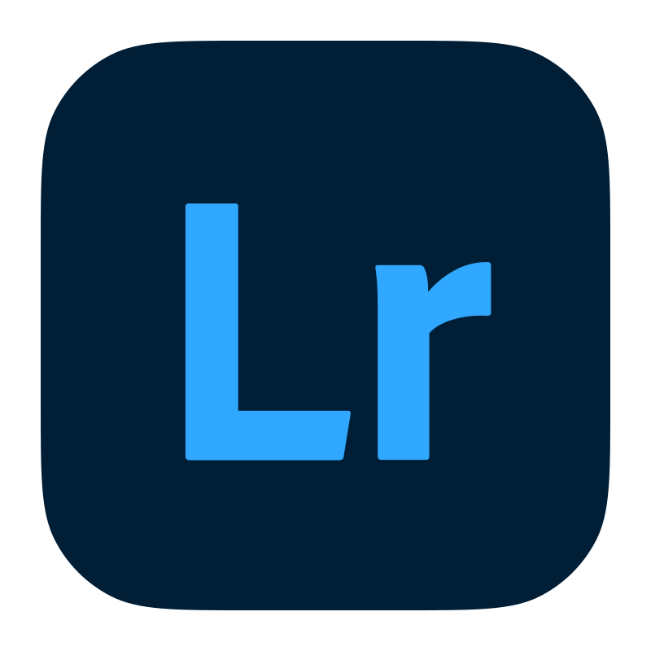
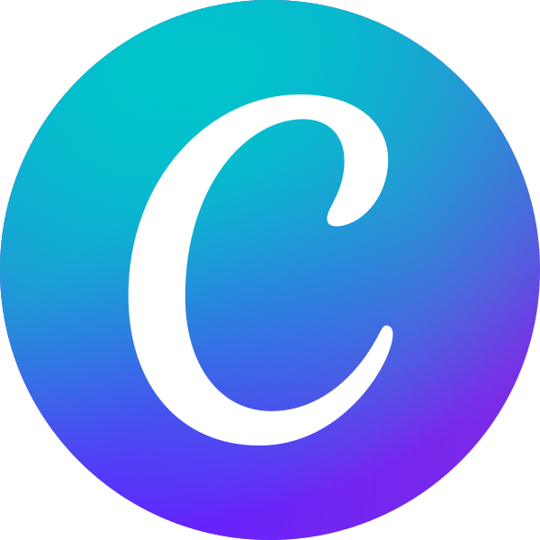
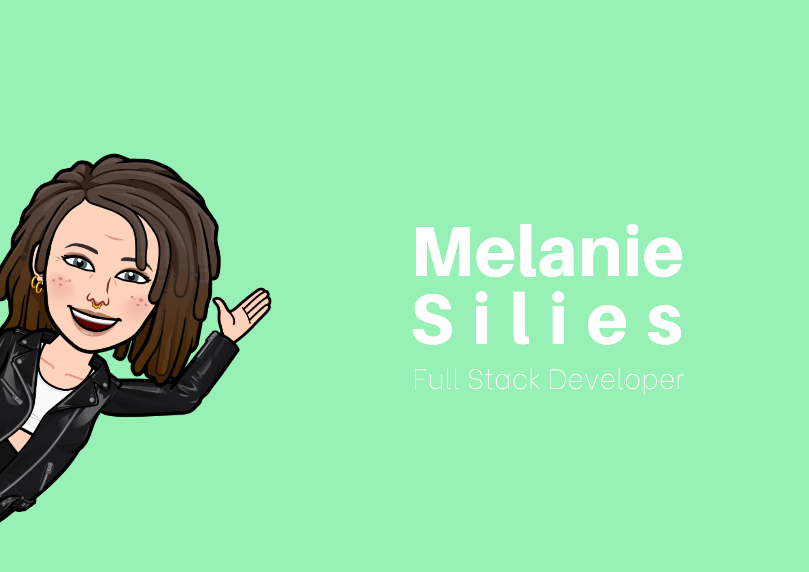
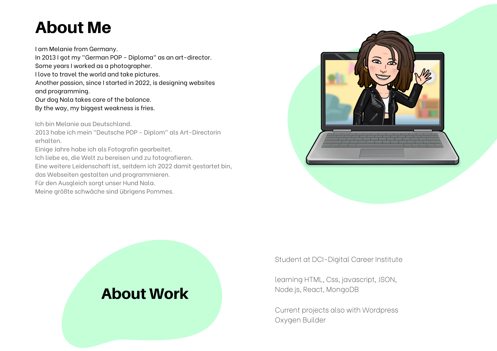
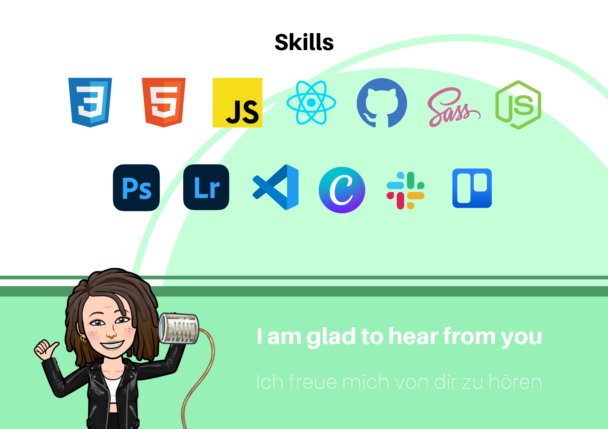

### Nice to meet you 👋
<!-- 
🇩🇪 I'm Melanie from Germany

📷 I'm a trained photographer and graphic designer

🌏 I'm passionate about travelling

🌱 I’m currently learning Full Stack Development at the DCI

🐶 My Dog Nala, a small havanese, provides cuddling in the office

🍟 Fun Fact: French fries are my big weakness

## Skills

 -->

<!--  -->

